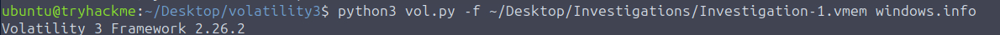
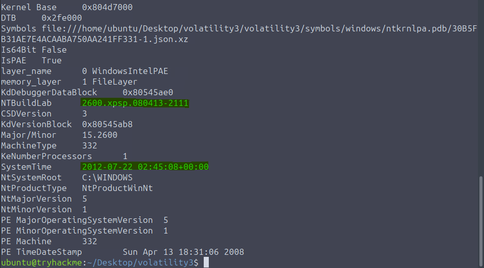
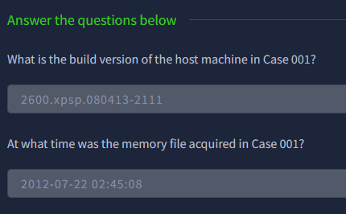

# Memory Analysis Introduction

[← Back to Home Page](../MDX%202025-2025%20Final%20Year.md)

###### This is a wide array of pre-course notes I took to prep for our module, please take these with a pinch of salt as these are based on multiple sources. Some from THM, documentation and even personal experience. Please do your own due diligence when it comes to using these notes.

##### Table of contents:

- [Volatile Memory](#volatile-memory)
- [RAM Structure (Rootkits)](#ram-structure)
- [RAM for Forensic Analysts](#ram-for-forensice-analysts)
- [Memory Dumps](#memory-dumps)
- [Memory-based Threat indicators](#memory-based-threat-indicators)
- [Memory Manipulation in Practice (My hacking using this knowledge)](#memory-manipulation-in-practice)
- [Rootkits](#rootkits)

##### Resources:

- [THM Link](https://tryhackme.com/room/memoryanalysisintroduction)
- [Rootkit](https://www.fortinet.com/uk/resources/cyberglossary/rootkit)
- [Practial](https://www.youtube.com/watch?v=EqGoGwVCVwM)

##### Acronym dictionary:

- RAM = Random Access Memory
- **FA/DF = Forensic Analysts/Digital Forensics**
- **MA/MF = Memory Analysis/Memory Forensics**
- **Vol3 = Volatility 3**
- VM = Virtual Memory (Not Volatile memory)
- OS = Operating System
- API = Application Programming Interface
- **THM = TryHackMe**

> BTD6, Minecraft, Raft are games for any of those unaware (Used as practical examples in memory hacking and manipulation)

---

### Brief run down:

RAM retrieval can be used to learn about threats, user activity and artefacts that are lost after shutdown.

Volatile memory refers to the stored data that holds system and user level data whilst the computer runs. When the system is `powered off or restarted`, this data is lost. Although, a common spot for this type of memory to still be available is the `RAM (Random Access Memory)`.

`RAM temporarily stores everything from open files, running processes and encrypted data.`

Since this data only exists whilst the system is active, investigators often prioritise capturing RAM as early as possible during an investigation.

---

### Volatile Memory

PCs store and access info using a hierarchy of memory, each level offering a trade-off between `speed and capacity`. Starting from the fastest to the slowest the order is:

### `CPU Registers > CPU Cache > RAM > Disk Storage`

CPU Registers and Cache are extremely fast but limited in size.

RAM is the main working memory for the OS and active program (minecraft).

Disk storage, while much slower is used for more long-term data retention


<br>
<br>

### Virtual Memory

The concept of Virtual Memory (VM), on the other hand, is a virtual memory space. When a program runs (like Minecraft), the OS assigns it virtual memory addresses that are mapped to physical RAM or, if needed, to disk-based swap space. Swap is a reserved area on the disk that the OS uses to store data from RAM when physical memory is full temporarily.

This means that the system can handle more active processes than the RAM alone can support. This allows processes to run as if they have dedicated memory whilst the system manages where the actual data resides. The OS continuously shifts data between RAM and disk depending on the system load and priority.

**Simply, this impacts MA because some forensic artefacts may reside in RAM whilst others may be temporarily stored in the swap files.**


##### [Back To Top](#memory-analysis-introduction)

---

### RAM Structure

RAM is usually the memory on which investigations will focus on.

It is divided into two broad areas - **Kernel Space and User Space**

- **Kernel Space** (_Ring 0_) is reserved for the OS and low-level services (Where advanced malware like [RootKit](#rootkits) operate to gain deeper system access and evade detection)
- **User Space** (_Ring 3_) contains processes launched by the user or applications (like `Minecraft, Raft, BTD6`), each gets its own separate space, protected from others

## 

**Within the user processes (Ring 3), memory is typically structured into several regions**

- **Stack** Stores temporary data such as function arguments, return addresses, and local variables. It grows and shrinks with each function call and return. For example, in Minecraft, when the game engine calls a function to place a block, the temporary data like block coordinates and local variables used in that function are stored on the stack. <br>
  Stack memory is useful for identifying the flow of execution and spotting function calls or return address tampering (eg stack pivoting in exploits).

  <br>

- **Heap** Used for dynamic memory allocation at runtime. Programs use the heap to store objects, buffers, and other large or variable-sized data structures that persist beyond individual function calls. For instance, in Raft or BTD6, when new inventory items or bloons are spawned, the associated objects and data are allocated on the heap. <br>
  Heap memory often contains artefacts like chat logs, usernames, decoded strings, injected payloads, or leftover fragments from previous objects (heap spray remnants).

---

#### In simple terms:

**Stack** = To-do list: you write a task (function call), complete it, then erase it.

**Heap** = Filing cabinet: you store a folder (object), and it stays there until you throw it out.

(**Volatile**)**Stack** purpose is temporary data per function, it stores functions args, local cars and return addresses. It has a short lifetime (lasts only while function runs).

Example is block posistion during placement, when placing the function needs to placeblock

```c
void placeBlock(int x, int y, int z) {
    // Block placing logic
}
```

So when the funciton calls the values x y z (block coords), they are pushed to the stack, once the funciton is done (block placed), this memory is freed immediately ready to hold the next stack (place block location). This is used for short-term, function specific info.

(**Persistent**) **Heap** purpose is to be long-term data at runtime, it stores objects, buffers or even game entities. The lifetime is long and can exist for the whole program. One example is inventory item data.

One example could be a block being placed but it is a chest (which stores items), and so aslong as it doesnt break, it would need to stay in memory, the program would need to allocate this block object to the heap.

---

- **Executable (.text)** Stores the actual code or instructions the CPU runs (e.g. the compiled game logic for placing blocks in Minecraft or tower shooting mechanics in BTD6)
- **Data Sections** Space that is used to store global variables and other data the executable may need (e.g. Minecraft's block types, Raft's item recipes, or BTD6's tower stats - data that persists throughout the program)

  **It is really important you understand this when it comes to identifying where forensic artifacts might be located. For instance:**

## 

- **Stack**: Shell commands, function parameters, recently typed passwords, temporary variables
- **Heap**: Encryption keys, downloaded files, chat messages, browser history, dynamically allocated buffers
- **Data Sections**: Hardcoded passwords, configuration settings, IP addresses, domain names
- **Executable**: Malware signatures, embedded payloads, packed/obfuscated code

##### [Back To Top](#memory-analysis-introduction)

---

### RAM for Forensic Analysts

The analysis of RAM offers a snapshot of what a system is doing at a particular moment, this can include running processes and loaded executables (Apple Music, Minecraft and other apps), open network connections and ports, logged-in users and recent commands, decrypted content including encryption keys and injected code or fileless malware.

Since all this info disappears once the system is turned off, MA provides a unique chance to observe the system in action. It often reveals evidence not available in disk forensics (FTK, hex editor), especially for attacks that do not write files to disk.

This makes memory a priority to target during incident response, particularly when dealing with live systems, malware investigations or suspected intrusions.

MF is often used early in an investigation to capture data that disappears on shutdown. It helps responders collect active processes, network connections and other live artefacts before losing them.

It is very useful when dealing with in-memory threats, fileless malware or credential theft. MA provides a snapshot of system activity that can help during an investigation.

##### [Back To Top](#memory-analysis-introduction)

---

## Memory Dumps

A memory dump is a snapshot (version) of a system's RAM at a specific point in time. It captures everything stored in [Volatile Memory](#volatile-memory), including running processes, active sessions, network activity and sometimes even sensitive data like credentials (passwords).

Memory Dumps are widely used for FA, malware investigations and threat hunting. Security teams (Blue team) analyse these snapshots to understand what was running on a system and to uncover suspicious or unauthorised activity. Tools like [Mimikatz](https://www.varonis.com/blog/what-is-mimikatz) are often used by red teamers and attackers to extract credentials directly from memory, making memory dumps an important defensive focus.

#### How Memory Dumps are Created

Creating a memory dump depends on the OS in use. The goal is to capture RAM content without significantly altering it during acquisition.

On **Windows**, tools like built-in crash dumps, Sysinternals' RAMMap or other third party utilities such as WinPmem and FTK Imager can be used to generate full or selective memory captures.

Some methods include kernel mode dumps located at `%SystemRoot%\MEMORY.DMP` and hibernation files stored as `%SystemDrive%\hiberfil.sys`.

On **Linux** and **MacOS**, analysts can use tools like LiME (Linux Memory Extractor), or dd with access to `/dev/mem` or `/proc/kcore`, depending on kernel protections.

**Software we are using on our course is called Volatility (Volatility Framework)**

It is one of the most widely used tools in DF for analysing VM (RAM).

#### Types of Memory Dumps

Memory dumps vary in scope and the purpose

**Full memory dumps** capture all RAM, including user and kernel space (Ring 0-3), useful for complete forensic investigations and malware analysis.

**Process Dump** captures the memory of a single running process. Helpful for reverse engineering or isolating malicious behaviour within a specific application.

**PageFile or Swap Analysis** Systems offload some memory content to [disk when RAM is full](#virtual-memory). These can contain fragments of data that were once in RAM, offering additional context.

In some cases, the systems hibernation file `hiberfil.sys` can also be parsed to extract RAM contents saved when the machine enters hibernation mode. [More info on that](https://diverto.github.io/2019/11/05/Extracting-Passwords-from-hiberfil-and-memdumps)

### Challenges that can happen with Memory dump acquisistion

Due to the fact attacks may know about memory dumps, they may deploy anti-forensic techniques to tamper with memory capture tools or hide their pressence within RAM.

Examples of this can include:


These methods require analysts to go beyond the default tools and use memory carving, kernal-level inspection and behaviour-based techniques to uncover hidden acitivty.

Lastly, there are encryption and obfuscation techniques which also are used to make memory content harder to interpret. Encrypted payloads or compressed code blcoks may be stored in memory and only decrypted at runtime, which adds a level of complexity to the analysis.

##### [Back To Top](#memory-analysis-introduction)

---

## Memory-based Threat indicators

MA is especially powerful for detecting threats that may not leave traces on a disk. While logs and file systems offer long-term evidence, memory reveals what is happening right now, making it an essetional part for identifying active or recently exectued attacks.

The most common artifcats that analysts look for in memory can include the following:

- Suspicous or malicous processes that are running without a crrosponding file on disk (The Practial in resources has an example of this)
- DDL Injection, which is malicious code that is injected into the memory space of a legitimate process (hidden).
- Process hollowing which is a technique where the memory of a trusted process is replaced with malicious code
- API hooking, used to intercept or alter normal function calls to hide activity or manipuate system behvaior
- [RootKits](#rootkits), espically those operating in kernal space, which manipulate memory strucutres to hide files, processes, or network connections

These techniques can often leave specific memoyr signatures, like unusual memory regions, non-matching PE headers, or code execution in writable memory areas which can be detected with forensic tools.

Some of the most common attacks that can be found while pefroming a MA:

#### Credential Access (MITRE ATT&CK: T1003)

> T1071 – Application Layer Protocol: Command and Control

Modern malware often communiats with external servers without dropping files (for example spyware). This fileless malware uses memory-resident payloads to fetch commands or exfiltrate data through standard protocols like HTTP, HTTPS or DNS. In memory, analyssts can find decrpted C2 Configs, IP Addresses or becaons that are not logged anywhere else to try find artifacts.

#### In-Memory Script Execution (T1086)

> T1086 – PowerShell

Scripts exectued from memory are harder to trace becoause they dont touch the disk. Attackers use powershell or other interperts (python, WMI) to execture code in RAM. MA may reveal full script contents, encoded commands, or runtime artifacts in the powershell process memory.

#### Persistence Techniques in Memory

These persistence mechanisms can be identified by spotting related artifacts during a live memory analysis:

> T1053.005 – Scheduled Task/Job: Scheduled Task

Task schedualr creates jobs that execute at intervals or startup. During a MA, we can look for processes like **schtasks.exe** and memory strings that contain task names or malicious payload paths.

> T1543.003 – Create or Modify System Process: Windows Service

Malicious services may run in the background under **services.exe**. We may find unusal servcice names, binaries or configs in memory that can relate to this technique.

> T1547.001 – Registry Run Keys / Startup Folder

Malware adds entires **HKCU\Software\Microsoft\Windows\CurrentVersion\Run** to executre on boot. These values can often be recovered from memory or found within registery hives cached in RAM.

### Lateral Movement via Memory Artifacts

Memory forensics can also expose attempts at lateral movement across systems. Common techniques can include:

> T1021.002 – Remote Services: SMB/Windows Admin Shares (PsExec)

**PsExec** enables command execution on remote systems. Analysts might find **PsExec-related** services or command-line arguments in memoyr indicating lateral movement.

> T1021.006 – Remote Services: Windows Remote Management (WinRM)

WinRM Provides powershell remoting. Look for **wsmprovhost.exe** and memory references to remote session initalization.

> T1059.001 – Command and Scripting Interpreter: PowerShell (Remote)

Powershell is commonly used for remote command exection. Analysts can detect base64-encoded or obfuscated commands within memory of the powershell processes.

> T1047 – Windows Management Instrumentation (WMI)

WMI commands like wmic process call create may be used to spawn remote processes. Associated command strings or class refrences may be cached in memory.

##### [Back To Top](#memory-analysis-introduction)

---

### THM MA Intro Practical


> **Flag:** THM{m3mory_analyst_g00d_job}

##### [Back To Top](#memory-analysis-introduction)

---

### Memory Manipulation in Practice

Understanding how memory works in theory is one thing, but seeing it in action really drives the concepts home. Since programs store their data in predictable memory locations, we can actually interact with and modify this data while the program is running.

As a theoretical exercise to prove my knowledge, here are my following experiments.


Because game data is stored in our local RAM at specific addresses, we can actually manipulate these values using tools like Cheat Engine. I've tested this with games like Minecraft, Raft, and BTD6. These values are stored in different variable types depending on how the game implements them.

For example, values that have stack limits or maximum values (like resources in Raft `20` and items in Minecraft `64`) can be found using **Exact Value** searches, which allows for easy modification of that specific memory location.

There are more complex values, such as money in BTD6, where there's no hard limit and the value is stored as a floating-point number (double). Searching for doubles using the same memory scanning method allows us to modify these values as well.

Here's that example, this specifically was an abuse of the multiplier on per bloon hit. Normally it is set to something low. But I changed it to the max, meaning that it would exponentially get bigger. This also triggered the rounds to rapidly fluctuate (visually, not actually) to the int limit, then into negatives.


Another technique is to prevent writes to a memory address entirely. By "freezing" or stopping the write to address functionality, the value becomes read-only from the program's perspective.

This essentially gives infinite resources since the program can't subtract from that value when items are used, and any new items picked up are effectively voided since the memory location can't be updated.

This hands-on experience with memory manipulation really reinforces the forensic concepts. It shows how volatile memory contains all the program state data that investigators need to capture and analyse during live system analysis.

##### [Back To Top](#memory-analysis-introduction)

---

## Rootkits

```js
Leaked by David, very important!

Very easy and cool concept of malware.

(My guess is that we will be looking for hidden rootkit inside of MBR or VBR)
```

Rootkits, like the name implies, is from the concept root access in the OS unix, this allows the user broad perms to change files and settings.

While most roots kits main purpose is to get into most offlitmits parts of the PC, all roots kits serve the same general purpose which is to conceale there own pressence or the pressence of another bit of malware.

Becaouse there own purpose is to be concelaed, they are often very hard to remove.

### How harmful/impressive are rootkits anyways?

So how do rootkits hide themselvs? Some, like we mentioned above in DDL Injection, hide themselves in legitimate coppies of programs, some more dangroues forms of rootkits hide themselves as a part of your OS kernal.

The core part of your OS that allow your programs to communicate with your hardware, through things like device drivers. Meaning, since drivers run in kernal mode [(Ring 0)](#ram-structure) many root kits disguise themselves as drivers.

```
Which is why you should only download drivers from trusted sources.
```

There are other kinds of rootkits that go beyond infecting the OS by tampering with the hard-drive boot sector. The rootkit code would be injected into the bootstrap code section of either:

```js
MBR: Bytes 446-509 (64 bytes of executable boot code)
VBR: Bytes 62-509 (448 bytes of executable boot code)
```

This is where the actual bootloader instructions live, the part that gets executed when the system starts up. The rootkit overwrites or modifies the executable code to run its payload before the legitimate OS loads, allowing it to load malicious code before the OS and even hook into disk-encryption routines.

The most persistent rootkits can even infect system firmware such as motherboard BIOS/UEFI or GPU BIOS. These firmware-level infections survive even factory resets and OS reinstalls, making them extremely difficult to detect and remove.

### Common rootkit famalies

**Firmware rootkits**

```
- BIOS/UEFI Rootkits (Motherboard firmware)
- GPU BIOS infections
- hard drive firmware rootkits
```

**Bootloader/Bot Sector Rootkits**

```
- MBR Rootkits (Master Boot Record)
- VBR Rootkits (Volume Boot Record)
- Boot Parition infections
```

**kernal-mode rootkits**

```
- Driver based rootkist [(Ring 0)](#ram-structure)
- Kernal Object Manipulation (DKOM)
- System call hooking
```

**Hardware Rootkits**

```
- Network card firmware
- USB device infections
- PCI device rootkits
```

### User-mode vs Kernal mode rootkits

##### User-mode

User-mode rootkits operatite in [(Ring 3)](#ram-structure), the same privilege level as standard applications like web browsers and minecraft, and do not have direct access to kernal memory of hardware.

They typically use techniques such as [DDL injection](#memory-based-threat-indicators), code injection or Important Address Table (IAT) hooking to intercept and modify API calls, allowing them to hide files, processes or registry entiries from user-level applications.

Becaouse they run in user space [(Ring 3)](#ram-structure), their impact is generally limitd to individual processes and a crash in a user-mode rootkit usually does no cause a system-wise failure.

##### Kernal-mode

Kernal-mode rootkits operate in [(Ring 0)](#ram-structure), the most privileged level where the OS kernal and drivers run, giving the rootkit unrestricted access to system resoruces and hardware. They can modify core kernal data strucutres using techniques like Direct Kernal Object Manipulation (DKOM), hook the System Service Descripter Table (SSDT) or even alter system call tables to subvert OS functionality and hide malicious activity.

Because they operate at the kernal level, they can compromise the integrity of an entire system, including security tools running in user mode, making detection and removal extermely difficult.

### Removal challenges & Modern Defenses

Trying to remove something you dont even know you have is very tricky, and large organisations have tried through logging suspiscous acesses requests through a firewall, dumping everything in memory to look for maliscouse code. But theses are not the things a home user can easily do, although modern motherboards with UEFI have some features to block rootkits, such as secure boot but has issues like not allowing legitimate things like multiple OS boots.

##### [Back To Top](#memory-analysis-introduction)

---

## Kernal and why kernal level systems are hated

There are many kernal level systems that automatically get installed with other programs, one example is Valorant. Valorant includes a kernal-level anti-cheat software, others also include one such as CS2, LoL and fortnite. Some of the most popular third party softwares include EasyAntiCheat, PunkBuster, BattleEye, nProtect GameGuard, Xigncode3 and EQU8.

Some devs use proprietary software like Riot's Gangaurd, activions Ricochet, Electronic Art's EA Anticheat or Blizzards Defense matrix.

**So why are they hated?**

Despite its effectiness in detecting cheats, kernal-level anti-cheat software is not without controversy. It can introduce vunarabilities into the system and has been associated with issues such as blue screen errors and system crashes. There are also concerncs about the potentianl misue or mishandling of senstive user information.

This could stem from china/USA based kernal based anti-cheat softwars being use for 'spyware' which is packaged with games. Most users don't like the idea of such a high level overview on their pcs.

##### [Back To Top](#memory-analysis-introduction)

---

### Case 1 - Genshin Impact

Genshin Impact had a kernel-level anti-cheat driver called **mhyprot2.sys**. Due to it being kernel-level, it requires a valid digital signature from Microsoft to run on Windows systems with Driver Signature Enforcement enabled.

The vulnerability arose because the legitimate signed driver contained flaws that could be exploited. Attackers could distribute this driver separately (without the game) and it would run without being flagged because it was already approved and digitally signed under Genshin Impact's anti-cheat system. This allowed malicious actors to gain kernel-level access without needing to bypass Windows security measures.

This is known as a "**Bring Your Own Vulnerable Driver**" (BYOVD) attack, where malicious actors exploit legitimate but vulnerable signed drivers to escalate privileges and perform malicious activities at the kernel level.

### Case 2 - NVIDIA Driver (CVE-2021-1056)

NVIDIA's graphics driver contained a critical vulnerability (CVE-2021-1056) in the **nvlddmkm.sys** kernel driver that allowed privilege escalation from user-mode to kernel-mode. The vulnerability was an improper validation of user-supplied data that could lead to memory corruption.

Attackers could exploit this flaw by sending specially crafted requests to the driver, allowing them to execute arbitrary code with kernel privileges. This gave attackers the ability to:

- Disable security software and endpoint detection tools
- Install persistent malware and rootkits
- Access sensitive system data and credentials
- Bypass User Account Control (UAC) restrictions

The vulnerability was actively exploited by multiple ransomware groups including LockBit, Conti, and REvil as part of their attack chains. They used it to escalate privileges and disable security defenses before deploying their ransomware payloads.

What made this particularly dangerous was that the NVIDIA driver is legitimately signed and present on millions of systems worldwide, making it an ideal target for BYOVD attacks. Even after patches were released, many systems remained vulnerable due to delayed updates.

#### Thoughts

One thing i was confused by is, why doesnt windows just verify kernal drivers like the mhprot2.sys by a simple hash check? if all it is, is a simple file being modified (normally what you do if you don't think you have the OG file).

One issue is drivers can be legitimatly updated and patched, meaning a small update/patch would trigger the system of a hash check. Kernal drivers and reguarly updated for compatibility, bug fixes and secuirty patches.

So instead of hashes, microsoft primarily relies on digital signatures to validate kernal drivers.

So a driver signed by a trusted certificate authority (CA) proves its orgiin and integrity without needing a fixed hash.

One idea i have is a 1:1 hash verification system for all kernel drivers sounds robust but is impractical due to the vast number of driver versions, frequent updates, and operational complexity. Instead, Microsoft relies on digital signatures to verify driver origin and integrity, balancing security with flexibility. However, a hybrid approach combining signatures with selective hash whitelisting exists in some Microsoft security systems, especially for high-risk drivers.

##### [Back To Top](#memory-analysis-introduction)

---

# Volatility Essentials

[THM box Back To Top](https://tryhackme.com/room/volatilityessentials)

[Github repo](https://github.com/volatilityfoundation/volatility3)

Need python 3.6 or later to run.
<br>

Going to be using and writing my revison notes for **Volatility 3** (latest version). It is made up of several key layers:

**Memory Layers**: These layers represent the hierarchy of address spaces, from raw memory to virtual address translations.
**Symbol tables**: The tables enbale kernal and process structures to be interpreted through OS-Specific debuggin symbols.
**Plugins**: These are modular routines that leverage the underlyinbg memory layers and symbol tables to extract artefacts of forensic interest.

Installing Volatility directly by cloning from the repo:

```shell
ubuntu@tryhackme:~/Desktop$ git clone https://github.com/volatilityfoundation/volatility3.git
ubuntu@tryhackme:~/Desktop$ cd volatility3
ubuntu@tryhackme:~/Desktop/volatility3$ python3 vol.py -h
Volatility 3 Framework 2.26.2
usage: vol.py [-h] [-c CONFIG] [--parallelism [{processes,threads,off}]] [-e EXTEND] [-p PLUGIN_DIRS] [-s SYMBOL_DIRS] [-v] [-l LOG] [-o OUTPUT_DIR] [-q]
              [-r RENDERER] [-f FILE] [--write-config] [--save-config SAVE_CONFIG] [--clear-cache] [--cache-path CACHE_PATH] [--offline | -u URL]
              [--filters FILTERS] [--hide-columns [HIDE_COLUMNS ...]] [--single-location SINGLE_LOCATION] [--stackers [STACKERS ...]]
              [--single-swap-locations [SINGLE_SWAP_LOCATIONS ...]]
              PLUGIN ...

An open-source memory forensics framework

options:
  -h, --help            Show this help message and exit, for specific plugin options use 'vol.py  --help'
  -c CONFIG, --config CONFIG
                        Load the configuration from a json file
------TRUNCATED--------

```

#### Memory Acquisition Methodologies

Memory acquistion is a foundation step in forensics that must be performed in a manner that ensures we maintain the integrity of evidence. The process and the deployment envrioment used very from one OS to another.

> David leaked that we will be using linux commands (may just be to navigate the commands etc, but could hint that we may be looking at a Linux OS system not just windows so).

##### For **windows systems**, the following tools can be used to conduct memory acquistion:

- **DumpIt** which captures a full physcial memory image on a 32/64 bit windows and automatically hashes theo utput

- **WinPmem** which is a open source driver based tool that acquires RAM in RAW/ELF formats and embeds acquistion metadata for chain of custody

- **Magnet RAM** Capture which is a GUI driven collector that snapshots volatile memory on live windows hosts while minimising footprint

- **FTK Imager** which is the most common commercial tool that acquires memory and selected logical artefacts alongside disk imaging functions

##### For linux and macOS systems, we can employ the services of the following tools:

- AVML which is a lightweight Microsoft CLI utility that dumps linux memory to a compresses ELF file without requiring a kernal module.

- LiME is a loadable kernal module for Linux that captures full volatile memory over a disk or network and supports ARM/x86 architectures.

- OSXPmem is a macOS specific fork of Pmem that creats raw memory images on Intel-Based Macs for subsequent volatility analysis.

**ELF format?**

---

_For any of those who are unaware, Mac used to buy intel CPUs instead of manufactoring there own as it was cheaper for the short term and just practically, Intel had better chips and for Apple to start trying to make them that early in the game wasnt feasible. Only in 2020 did they announce the plan to shift to custom designed ARM based chips that Apple reffered to as Apple silicon._

_This is one of the issues i had when it came to getting Virtual Machines (VMs) running on peoples Macs as the silicon CPUs have a completly different architecture than the intel CPUs and there for the setup was unknown/impossible for awhile and few tutorials online actaully work._

**This means, looking at the Mac age/version is important as the differnece between a pre/post silicon change can mean a compeltly differnt strategy when it comes to some tools/setups.**

---

Extracting memory from virtual envrioments can be done by collecting the virtual memory file from the host machines drive. Depending on the hypervisor in use, the output file will likely differ and you would likely encounter the following examples:

- **VMware** - .vmem
- **Hyper-V**- .bin
- **Parallels** - .mem
- **VirtualBox** - .sav It is worth noting that this is a partial memory file.

> Not sure what VM David will go with, but it will most liekly be VirtualBox, which is the one you have if you followed the CyberSec Society tutorials.

##### Memory Analysis

To have a holistic and hands on understanding of Volatility, we shall investigate a forensic case and use it to learn about the tools inner workings (**THM linked above)**. The file for analysis are found under the Desktop/Investigations directory.

##### Case 001

Your SOC has informed you that they have gathered a memory dump from a quarntined endpoint throught to have been compromised by a banking trojan masquerading as an Adobe document. Your job is to use your knowledge of threat intelligence and reverse engineering to perform memory forensics on the infected host.

You have ben infomred of a sus IP in a connection with the file Investigation-1.vmem that could be helpful (41.168.5.140)

**Plugins**

Volatility uses plugins to request data to carry out analysis. Some of the most commonly used plugins include:

```
windows.info
linux.info
pslist
pstree
```

Let us look at these plugins, extracting information from our memory file. First, we can begin obtaining operating system detials from the image. In previous versions of Volatility, this information was identified as OS profiles and was extracted using the plugin imageinfo. However, OS proifles have been deprecated in the new version, and now we have the individual information plugins.

Given that our memory file was obtained from a Windows VM running VMware (vmem) we can extract details about its profile with the command below:

```shell
~/Desktop/volatility3$ python3 vol.py -f ~/Desktop/Investigations/Investigation-1.vmem windows.info

Volatility 3 Framework 2.26.2
WARNING  volatility3.framework.layers.vmware: No metadata file found alongside VMEM file. A VMSS or VMSN file may be required to correctly process a VMEM file. These should be placed in the same directory with the same file name, e.g. Investigation-1.vmem and Investigation-1.vmss.
Progress:  100.00               PDB scanning finished
Variable        Value

Kernel Base     0x804d7000
DTB     0x2fe000
Symbols file:///home/ubuntu/Desktop/volatility3/volatility3/symbols/windows/ntkrnlpa.pdb/30B5FB31AE7E4ACAABA750AA241FF331-1.json.xz
```



We can extract the system version, architecture, symbol tables, and avaible memory layers from the details.




---

### Listing Processes and Connections

When we want to analyse details on processes and network connections from our memory file, Volatility supports different plugins, each with varying techniques used. Not all plugins mentioned here will produce a result from the memory file, as the capture may not have included processes or services that the plugins would enumerate.

##### Active Process Enumeration

The most basic way of listing processes is by using `pslist`. The plugin enumerats active processes from the doubly-linked list that keeps track of processes in memory, equivalent to the process list in the task manager. The output from this plugin will include all current and terminated processes and their exit times.

```shell
python3 vol.py -f ~/Desktop/Investigations/Investigation-1.vmem windows.pslist
```

##### Hidden Process Enumeration

Some malware, typically [rootKit](#rootkits) will in an attempt to hide their processes, unlik themselves from the list. By unliking themselves from the list, you will no longer see their processes when using `pslist`. To combat this evasion technique, we can use `psscan`. This technique of listing processes will locate processes by finding data structures that match `_EPROCESS`. While this technique can help with evasion countermeasures, it can also result in false positives, therefore we must be careful.

```shell
python3 vol.py -f ~/Desktop/Investigations/Investigation-1.vmem windows.psscan
```

##### Process Hierarchy Enumeration

The third process plugin, `pstree`, does not offer any other kind of special technies to help idenitfy evasion like the last two plugins. However, this plugin will list all processes based on their parent process ID, using the same methods as `pslist`. This can be useful for an analyst to get a complete story of the processes and what may have occurred at the extraction time.

```shell
python3 vol.py -f ~/Desktop/Investigations/Investigation-1.vmem windows.pstree
```

##### File, Registry, and Thread Enumeration

Inspecting files and registry is also vital during a memory forensic investigation. We can use the plguin `handles` to look into the details and handles of files and threads from a host.

```shell
python3 vol.py -f ~/Desktop/Investigations/Investigation-1.vmem windows.handles
```

---

##### Network Connection Enumeration

Now that we know how to identify processes, we also need to have way to identify the network connections present at the time of extraction on the host machine. The `netstat` will attempt to identify all memory structures with a network connection.

```shell
python3 vol.py -f ~/Desktop/Investigations/Investigation-1.vmem windows.netstat
```

It is worth noting that this command in the current state of Volatility 3 can be very unstable, particularly around old Windows builds. To combat this, you can utilise other tools like [Bulk-extractor](https://www.kali.org/tools/bulk-extractor/) to extract a PCAP file from the memory file. Sometimes, this is preferred in network connections that you cannot idenitfy from Volatility alone.

##### TCP/UDP Socket Enumeration

We can also identify network sockets and their linked processes from a memory file. To do this, we can use the plugin `netscan`. This will recover active and closed TCP/UDP connections, associated process IDs, local and remote ports, and IPs using memory pool scanning.

```shell
python3 vol.py -f ~/Desktop/Investigations/Investigation-1.vmem windows.netscan
```

##### DLL Enumeration

The last plugin is `dlllist` this plugin will list all DDLs associated with processes at extraction time. This can especially be useful once you have analysed further and filitered the output to a specific DLL that might indicate a specfiic type of malware you belive to be on the system.

```shell
python3 vol.py -f ~/Desktop/Investigations/Investigation-1.vmem windows.dlllist
```

##### [Back To Top](#memory-analysis-introduction)

---

## Lacking Revision notes

##### Ram/Swap

RAM Disappears on shutdown as its volatile, but the swap is on disk, so even after shutdown, you might still find traces of data like passwords, msgs, malware code and session data.

Thats why forensic analysts look at both:

**Ram**: While system is on
**Swap files**: If system is off (Located at pagefile.sys)

##### Memory hierachy fastest to slowest

CPU Registers
CPU Cache
RAM
HDD/SSDs

##### Stack and Heap

### **Stack Memory**

**Characteristics:** Simpler and faster but more limited. Size is known ahead of time and can exist within one function.

**Stack Artifacts:**

- [ ] Function parameters - arguments passed to functions
- [ ] Return addresses - where the program should jump back to after a function completes
- [ ] Local variables - temporary variables used within functions
- [ ] Shell commands - recently executed command line inputs
- [ ] Recently typed passwords - especially if they were processed by authentication functions
- [ ] Function call history - sequence of function calls (call stack)
- [ ] Temporary encryption keys - keys used briefly during cryptographic operations
- [ ] User input data - keyboard input being processed by input functions
- [ ] File paths - temporary path strings being processed
- [ ] Network connection parameters - IP addresses, ports passed to network functions

### **Heap Memory**

**Characteristics:** Slower and more complex to work with. Size unknown ahead of time or return value isn't limited to one function.

**Heap Artifacts:**

- [ ] Chat logs and messages
- [ ] Usernames and credentials
- [ ] Decoded/decrypted strings
- [ ] Injected malicious payloads
- [ ] Browser history fragments
- [ ] Downloaded file remnants

**DLL Injection** = adds malicious code to a legitimate process (partial injection)
**Process Hollowing** = replaces the entire legitimate process content with malware (complete replacement)

##### [Back To Top](#memory-analysis-introduction)
